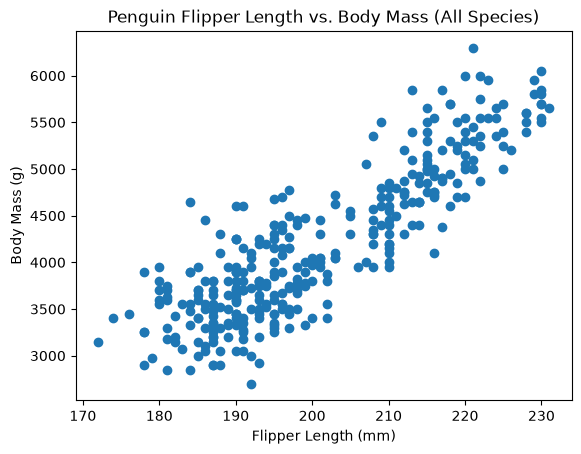
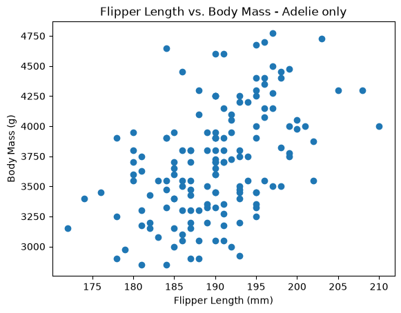
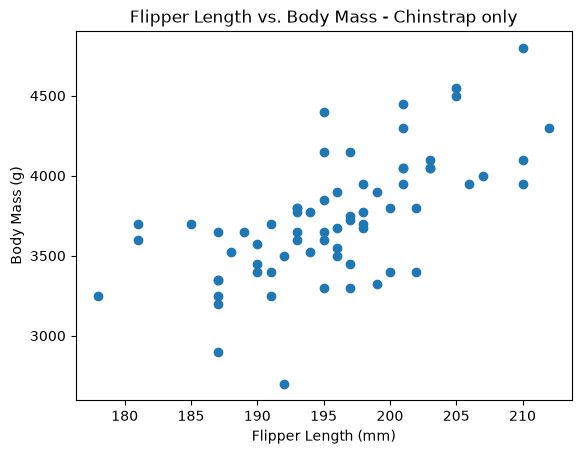
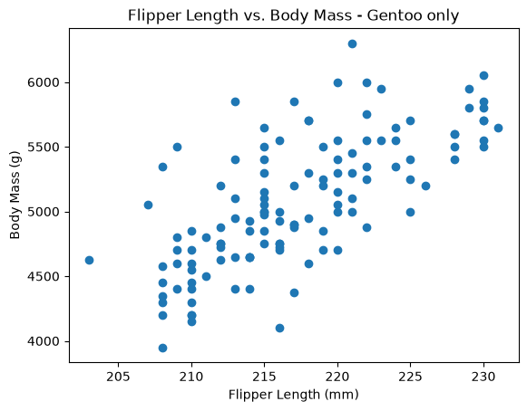
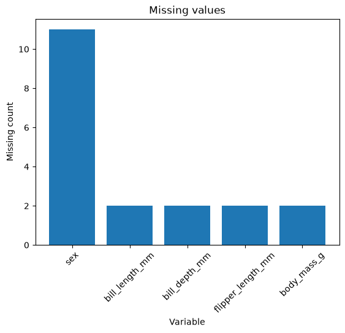

# Penguin EDA

> Exploratory data analysis of the Palmer Penguins dataset, testing whether a
> strong pooled correlation survives being split into subgroups.

## The Question

The starting example reports one correlation between flipper length and body
mass across all 344 penguins: **r = 0.871**. That reads as a very strong
relationship, and it is the kind of number that ends up in a summary without
much scrutiny.

But the dataset holds three species of noticeably different size. If Gentoo
penguins are simply bigger than Adelie and Chinstrap on both measurements at
once, part of that 0.871 is a size gap between species rather than a
flipper-to-mass relationship within any of them.

This project recomputes the same correlation separately inside each species to
find out.

## Results

| Group | n | r |
|---|---|---|
| Adelie | 152 | 0.468 |
| Chinstrap | 68 | 0.642 |
| Gentoo | 124 | 0.703 |
| **Pooled** | **342** | **0.871** |

Every species falls below the pooled figure. Adelie loses almost half the
apparent relationship.

### All species pooled

The pooled scatter looks like a clean upward line. Nothing in this chart
suggests it is made of three separate clusters.

### Split by species

Each species occupies its own region of the pooled chart. Within any one of
them the points are more scattered and the slope is less convincing.

## Interpretation

The relationship is real within each species. It is just weaker than the
headline number suggests.

The pooled figure is inflated because Gentoo penguins are larger than Adelie
and Chinstrap on both measurements at once. Pooling the species turns that
between-species size gap into what looks like a flipper-to-mass relationship.
Reporting only r = 0.871 would overstate how well flipper length predicts body
mass for any individual penguin.

The lesson generalizes past penguins. An aggregate statistic computed across
mixed groups can carry a between-group difference that reads as a within-group
relationship. Checking whether a pooled number holds inside its subgroups is
cheap and worth doing before reporting it.

## Data Quality

344 rows, one row per observed penguin. Seven columns.

- 11 rows are missing `sex` (3.2%)
- 2 rows are missing all four measurement columns (0.58%)
- No duplicate rows

The missing values are a small enough share that they do not change the
conclusions here, but they are worth knowing before any modeling.

See the [**Data Card**](./data-card.md) for full column descriptions.

## Method

The analysis follows a repeatable eight-step EDA process: load, inspect, check
quality, describe, visualize distributions, explore relationships, summarize,
display.

Step 6 was extended with a loop that filters the DataFrame to one species at a
time and recomputes the correlation on that subgroup, producing a scatter plot
for each.

## Professional Workflow

See [**Workflow B: Apply Example Project**](https://denisecase.github.io/pro-analytics-02/workflow-b-apply-example-project/)
to get a project like this running on your machine.

## Professional Projects

- We code like the pros to help us **focus on the analytics**.
- Most files in this repository will never be touched.
- If curious about a file, check out the
  [Professional Python Project Explainer](https://denisecase.github.io/professional-python-project-explainer/).

## Documentation Index

- **Home** - this landing page
- [**Project Instructions**](./project-instructions.md)
- [**Concepts**](./concepts.md)
- [**Data Card**](./data-card.md)
- [**API**](./api.md)

## Additional Project Pages

- [**Resources**](./resources.md)
- [**Seaborn Datasets**](./seaborn-datasets.md)
- [**Troubleshooting**](./troubleshooting.md)

## Produced Artifacts

- [**Reactive EDA App (marimo)**](./app/)
- [**Reactive EDA Notebook (marimo)**](https://github.com/jgdavis24/datafun-04-eda/blob/main/src/datafun/notebook.py)
- [**Jupyter Notebook**](https://github.com/jgdavis24/datafun-04-eda/blob/main/notebooks/eda.ipynb)
